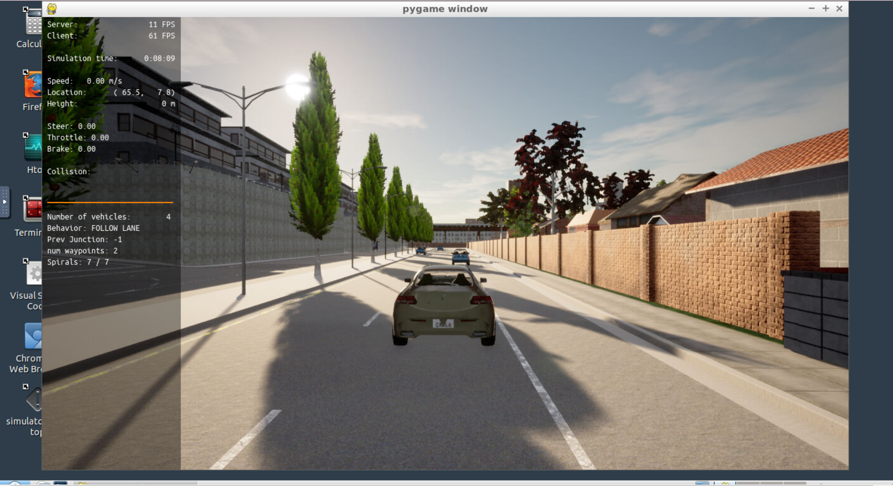
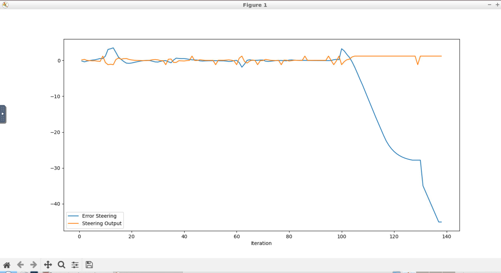
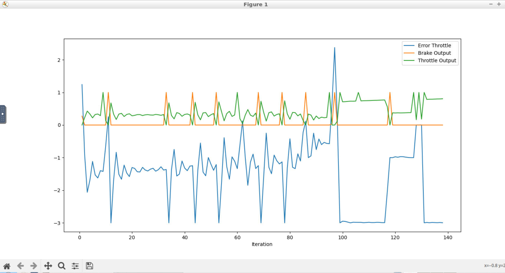

Step 1:

Step 4:

What is the effect of the PID according to the plots, how each part of the PID affects the control command?

- I can see that when the error moves in one direction the steer control moves in the other direction. To move to the correct trajectory.

- There was an error at the end. I do not know why.

What is the effect of the PID according to the plots, how each part of the PID affects the control command?

- I can see that each time that I braked the error went down into the negative side! Then throttle was given to move throttle error upwards to 0. Most of the time error was in the negative side, meaning that the controller is conservative in not accelerating too much and go to another place.

How would you design a way to automatically tune the PID parameters?

- I would use Coordinate Ascent to find optimal parameters.

PID controller is a model free controller, i.e. it does not use a model of the car. Could you explain the pros and cons of this type of controller?

Model Free Controllers.

Cons:

- They do not generate optimal control.
- They have difficulties with non-linearities.

Pros:

- Are applicable to many control problems.
- Perform satisfactorily without any improvements or only coarse tuning.

What would you do to improve the PID controller?

- I would use Coordinate Ascent to find optimal parameters. 

